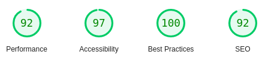

# :zap: Delivery - Home Delivery App Landing Page Template - Clone

<!-- ABOUT THE PROJECT -->
## Sobre o projeto
Este projeto é um clone de [Home Delivery From Stores Near You](https://preview.uideck.com/items/delivery/#h5o-21) desenvolvido com a finalidade pratica a escrita de HTML5 Semântico, seguindo as boas patricas da [WHATWG community](https://whatwg.org) e outras tecnologias com Sass ultilizando o CSS Orientado a Objeto  

(<a href="#readme">volta ao topo</a>)

## Construído com
- HTML5 Semântico
- CSS3
- Object-oriented CSS
- SASS

(<a href="#readme">volta ao topo</a>)

<!-- Google Lighthouse -->
## Google Lighthouse

(<a href="#readme">volta ao topo</a>)

<!-- LICENSE -->
## License

Distribuído sob a licença GNU General Public License v3.0. Veja `LICENSE.txt` para mais informações.

(<a href="#readme">volta ao topo</a>)

<!-- CONTACT -->
## Contato

Walisson Aguirra - walisson.aguirra@gmail.com

Link do projeto: [https://github.com/walissonaguirra/website-delivery-clone](https://github.com/walissonaguirra/website-delivery-clone)

(<a href="#readme">volta ao topo</a>)

